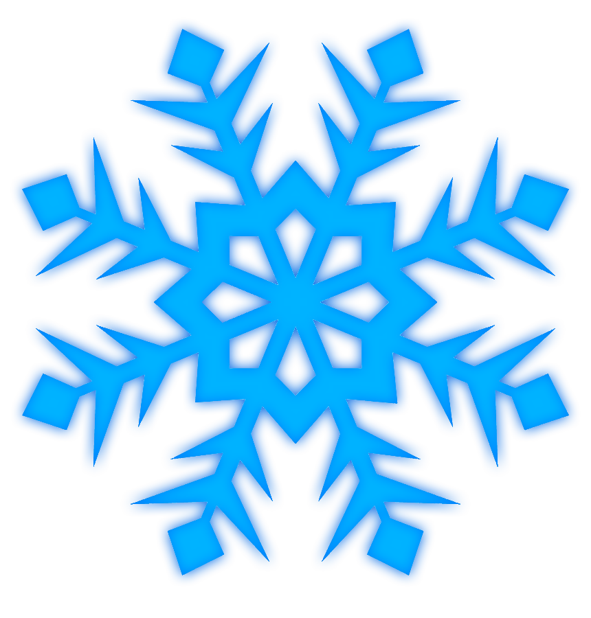

# Snowfall Documentation

<!-- LOGO -->
 

  

  <h3 align="center">Snowfall Core</h3>

  

    Outpowering all the network features you need!
     
    <a href="https://discord.frozed.club/"><strong>Join the discord »</strong></a>
     
     
    <a href="https://github.com/Clouke">Clouke</a>
    ·
    <a href="https://github.com/Lucaniuss">Lucanius</a>
    ·
    <a href="https://github.com/Elb1to">Elb1to</a>
  

<!-- FEATURES -->
## Features
- [x] Staff Modules
- [x] Punishments
- [x] Ranks
- [x] Network Overview
- [x] Disguise, NPC's & Holograms
- [x] Guilds & Friends system 
- [x] Thread safe, Ascendancy performance   
- [x] Fast synchronized user & network data
- [x] Full time updates
- [x] Command Configurability
- [x] Modern In-Game UI Configurability 
- [x] 100% Configurability

<!-- REQUIREMENTS -->
## Requirements
- [x] [MongoDB](https://www.mongodb.com/)
- [x] [Redis](https://redis.io/)

<!-- PRICING -->
## Pricing
* Jar (License & Loader) 50$
* Source Code (Full-Access) 350$

<!-- Placeholders -->
## Placeholder API
    %snow_player_rank% - The rank name of player
    %snow_player_nicerank% - The formatted coulored rank name of player
    %snow_player_namecolor% - The name color of player
    %snow_player_disguise% - The disguise name of player
    %snow_player_rankcolor% - The rank color of player
    %snow_player_guild_name% - The guild name of player
    %snow_player_rank% - The rank name of player
    %snow_bool_vanish% - The boolean value of player's vanish
    %snow_bool_disguise% - The boolean value of player's disguise
    %snow_bool_modmode% - The boolean value of player's modmode

## Permissions
### Commands
* snowfall.command.chatclear
* snowfall.command.chat
* snowfall.command.gmc
* snowfall.command.gms
* snowfall.command.hologram
* snowfall.command.npc
* snowfall.command.teleport
* snowfall.command.teleporthere
* snowfall.command.teleportpos
* snowfall.command.teleportworld
* snowfall.command.feed
* snowfall.command.fly
* snowfall.command.heal
* snowfall.command.modmode
* snowfall.command.more
* snowfall.command.speed
* snowfall.command.sudo
* snowfall.command.vanish
* snowfall.command.network
* snowfall.command.grant
* snowfall.command.grants
* snowfall.command.reports
    
* snowfall.command.ban
* snowfall.command.blacklist
* snowfall.command.kick
* snowfall.command.mute
* snowfall.command.warn
    
* snowfall.command.unban
* snowfall.command.unmute
* snowfall.command.unblacklist
    
* snowfall.command.alts
* snowfall.command.freeze
* snowfall.command.unfreeze
* snowfall.command.punishments
* snowfall.command.id
    
* snowfall.command.rank
* snowfall.command.addinheritance
* snowfall.command.addperm
* snowfall.command.createrank
* snowfall.command.rankdelete
* snowfall.command.importranks
* snowfall.command.ranklist
* snowfall.command.removeinheritance
* snowfall.command.removeperm
* snowfall.command.saveranks
* snowfall.command.setbold
* snowfall.command.setchatcolor
* snowfall.command.setcolor
* snowfall.command.setdefault
* snowfall.command.setitalic
* snowfall.command.setprefix
* snowfall.command.setweight
    
* snowfall.command.adminchat
* snowfall.command.staffchat
* snowfall.command.togglestaffmessages
    
* snowfall.command.user-addperm
* snowfall.command.remove-perm
* snowfall.command.user-info
* snowfall.command.user
    
* snowfall.command.disguise

### Other
* snowfall.chatcooldown.bypass
* snowfall.staff
* snowfall.punishments.permanent
